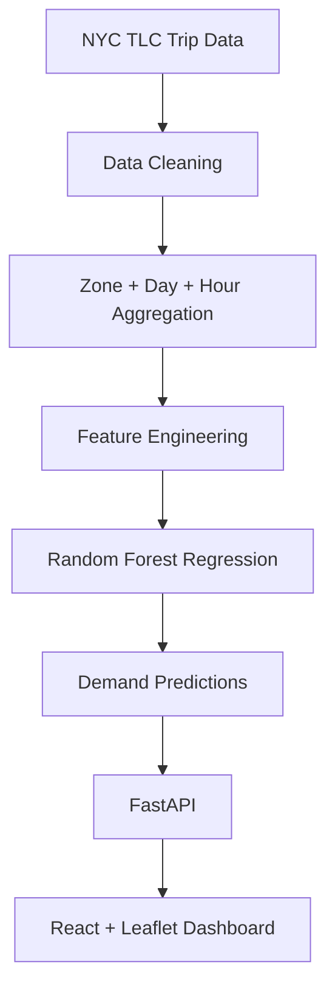

# Ride-Hailing Demand Heatmap Predictor

A full-stack dashboard that estimates NYC yellow taxi pickup demand by zone, weekday, and hour. It visualizes predictions across 263 taxi zones and recommends high-demand areas to inform driver positioning.

## Demo

Run locally at **http://127.0.0.1:5173/** with the backend on port 8000. The dashboard provides an interactive NYC demand map, day/hour controls initialized from NYC time, and clickable top-five zone recommendations.

## Features

- Demand predictions for all 263 taxi zones by weekday and hour.
- Interactive choropleth with eight consistent demand ranges, hover tooltips, and zone selection.
- Automatic initial selection using current NYC time, followed by unrestricted manual exploration.
- Ranked recommendations with predicted pickup counts and smooth map navigation.
- Responsive dashboard with loading, empty, error/retry, and stale-response handling.
- React frontend and FastAPI backend serving a saved Random Forest regression pipeline.
- Model evaluation against a historical-mean baseline using MAE, RMSE, and R².

## How It Works



Offline processing cleans trip records and computes monthly average pickup counts for each zone/weekday/hour bucket. These aggregates become training observations for a regression pipeline, saved with its preprocessing steps.

At runtime, FastAPI loads the model and GeoJSON once per process. Each demand request constructs inputs for all 263 zones and runs inference for the selected weekday/hour. Recommendations rank the same predictions, and the dashboard joins them to real zone polygons. No training or raw-trip processing happens inside an API request.

## Dataset

Source: [NYC Taxi & Limousine Commission Trip Record Data](https://www.nyc.gov/site/tlc/about/tlc-trip-record-data.page).

- **Yellow Taxi trips, May 2026:** [official Parquet download](https://d37ci6vzurychx.cloudfront.net/trip-data/yellow_tripdata_2026-05.parquet).
- **Taxi Zone Lookup table:** zone IDs, names, boroughs, and service-zone information.
- **NYC taxi zone shapefile and existing GeoJSON:** geographic boundaries rendered on the map.

Pickup location is represented by `PULocationID`, a taxi-zone identifier, rather than raw latitude/longitude. It corresponds to GeoJSON `LocationID`. The map displays zone polygons, not individual GPS pickup points. Field definitions are available in the [Yellow Taxi data dictionary](https://www.nyc.gov/assets/tlc/downloads/pdf/data_dictionary_trip_records_yellow.pdf).

## Data Processing

1. DuckDB reads only `tpep_pickup_datetime` and `PULocationID` from Parquet.
2. Remove null, invalid, or nonfinite timestamps and zone IDs; reject fractional IDs and keep IDs **1–263**.
3. Retain timestamps from May 1, 2026, inclusive, to June 1, exclusive. Interpret pickup timestamps as NYC local wall-clock time.
4. Extract hour **0–23** and weekday **Mon–Sun**; derive the weekend indicator when constructing the training table.
5. Group pickups by zone, weekday, and hour. Divide each count by the number of occurrences of that weekday in May, including zero-trip dates in the denominator.
6. Write `data/demand_aggregates.json` and flatten it in memory for model training.

The aggregates include **263 × 7 × 24 = 44,184 observations**. Unobserved buckets have zero targets. For example, 100 Monday 18:00 pickups across May's four Mondays yield an average of 25 pickups per hour.

The supplied file contains 4,090,836 rows, of which 4,084,337 pass cleaning. There are 257 observed zones, while the output covers all 263. GeoPandas validates the existing GeoJSON; aggregation does not regenerate or modify the original zone files.

## Machine Learning Model

The model is a scikit-learn `RandomForestRegressor` with 100 trees, `min_samples_leaf=2`, no maximum depth cap, and `random_state=42`.

| Feature | Representation |
| --- | --- |
| `zone_id` | Categorical; one-hot encoded |
| `hour_of_day` | Numeric, 0–23 |
| `day_of_week` | Categorical, Monday=0 through Sunday=6; one-hot encoded |
| `is_weekend` | Boolean indicator for Saturday/Sunday |

The target, `pickup_count`, is the **average hourly pickup count for the corresponding zone/weekday/hour bucket**, not a monthly total or probability.

A `ColumnTransformer` uses `OneHotEncoder(handle_unknown="ignore")` for zone and weekday, passing through hour and weekend. Random Forest supports nonlinear relationships and interactions among these encoded categorical and time-derived features and produces continuous estimates. Zone IDs carry no assumed numerical or geographic ordering.

After evaluation, the complete preprocessing/model pipeline is refitted on all observations and saved to `data/model.joblib` with `joblib`. The backend loads it once and returns nonnegative predictions without a silent historical-average fallback.

## Model Evaluation

Evaluation uses an 80/20 random split of aggregated observations with `random_state=42`: **35,347 training rows and 8,837 test rows**. Metrics for the current configuration are stored in [data/model_metrics.json](data/model_metrics.json).

| Model | MAE | RMSE | R² |
| --- | ---: | ---: | ---: |
| Historical-mean baseline | 5.858 | 21.708 | 0.864 |
| Random Forest — current configuration | 3.602 | 13.458 | 0.948 |

The baseline uses training-only zone/hour means across weekdays, falling back to training zone and global means when needed. Looking up the exact held-out zone/weekday/hour average would reveal the target itself, so it is not a valid baseline comparison.

For comparison, the project's recorded depth-limited forest (`max_depth=32`) evaluation is:

| Model | MAE | RMSE | R² |
| --- | ---: | ---: | ---: |
| Historical-mean baseline | 5.858 | 21.708 | 0.864 |
| Random Forest | 9.251 | 19.483 | 0.890 |

That configuration improved RMSE and R² but had **worse MAE** than the baseline. Those figures do not describe the current uncapped forest, which improves all three metrics on this split.

- **MAE:** average absolute prediction error, in pickups per hour.
- **RMSE:** error in the same units, with larger misses penalized more strongly.
- **R²:** variance explained relative to a mean-target reference predictor; it is not an accuracy percentage.

These results measure interpolation/generalization of monthly-average buckets from the available May 2026 data. They are **not a true future-month forecasting benchmark**.

## API

Base URL: `http://127.0.0.1:8000`. Interactive documentation: `http://127.0.0.1:8000/docs`.

### Health

`GET /health`

Returns `{"status":"ok"}` as a process-liveness check, independent of model/data availability.

### Demand

`GET /api/demand?day=Mon&hour=18`

Returns `day`, `hour`, and `data`: 263 records containing `zoneId` and `predictedCount`.

### Zones

`GET /api/zones`

Returns the GeoJSON FeatureCollection, preserving polygon geometry and properties including `LocationID`, `zone`, and `borough`.

### Recommendations

`GET /api/recommend?day=Mon&hour=18&top=5`

Returns `day`, `hour`, and `recommendations` with `zoneId`, `zoneName`, and `predictedCount`. Results sort by descending prediction, breaking ties by ascending zone ID.

For prediction endpoints, `day` must be `Mon`, `Tue`, `Wed`, `Thu`, `Fri`, `Sat`, or `Sun`; `hour` must be an integer from 0–23. `top` defaults to 5 and accepts integers from 1–263. Invalid parameters return HTTP 422. Missing or invalid model/GeoJSON artifacts return HTTP 503 on dependent endpoints.

## Frontend

The dashboard uses React, Vite, Tailwind CSS, Leaflet, and React-Leaflet. A day selector and hour slider update the choropleth and recommendation panel together. Hovering reveals zone details; clicking a polygon or recommendation highlights the zone and smoothly focuses the map. Desktop places the map and rankings alongside each other; mobile stacks them.

Predictions join to polygons using **GeoJSON `LocationID` ↔ API `zoneId`**, never array position or ordering. Eight fixed ranges span 0–5, >5–20, >20–50, >50–100, >100–150, >150–200, >200–300, and >300 pickups per hour. Colors progress from blue/cyan through green/yellow to orange/red. Missing values are gray, distinct from zero; thresholds remain consistent across time selections.

Requests are debounced and superseded requests are aborted to prevent stale responses from replacing newer selections. Loading, empty-data, connection-error, and retry states are included.

## Automatic Time Selection

On each fresh page load, the browser supplies the current date/time. `Intl.DateTimeFormat` converts it to `America/New_York`, handling daylight saving time automatically, and initializes the selected weekday and hour.

The NYC-time indicator records the time at opening. Users can then change day/hour freely; the app does not continuously override their selection. No GPS or location permission is requested, and physical location is not used.

## Project Structure

```text
RideHailing/
├── backend/
│   ├── aggregate.py
│   ├── main.py
│   ├── train_model.py
│   ├── test_aggregate.py
│   ├── test_model.py
│   ├── test_api.py
│   └── requirements.txt
├── data/
│   ├── raw/
│   ├── taxi_zones/              # Original shapefile components and GeoJSON
│   ├── yellow_tripdata_2026-05.parquet
│   ├── taxi_zone_lookup.csv
│   ├── taxi_zones.geojson
│   ├── demand_aggregates.json
│   ├── model.joblib
│   └── model_metrics.json
├── frontend/
│   ├── src/
│   │   ├── components/
│   │   │   ├── DemandMap.jsx
│   │   │   ├── TimeControls.jsx
│   │   │   └── RecommendationPanel.jsx
│   │   ├── App.jsx
│   │   ├── main.jsx
│   │   ├── index.css
│   │   ├── api.js
│   │   ├── demand.js
│   │   ├── demand.test.js
│   │   └── nycTime.js
│   ├── tests/
│   │   ├── dashboard.spec.js
│   │   ├── nyc-time.spec.js
│   │   └── compact-layout.spec.js
│   ├── .env.example
│   ├── index.html
│   ├── package.json
│   ├── package-lock.json
│   ├── playwright.config.js
│   └── vite.config.js
├── .gitignore
└── README.md
```

The raw Parquet and generated artifacts are currently tracked. Geometry is served by the backend; there is no separate frontend `public/` GeoJSON copy.

## Installation

Use **Python 3.12** and **Node.js 24**, the versions used for this project, with npm available.

### Backend

In PowerShell:

```powershell
cd C:\RideHailing
python -m venv .venv
.\.venv\Scripts\Activate.ps1
pip install -r backend\requirements.txt
```

The existing `data/model.joblib` and `data/taxi_zones.geojson` are sufficient to start the API. To train or regenerate the model from the existing aggregates:

```powershell
python backend\train_model.py
```

This writes the model and evaluation metrics. If aggregates are missing, follow Data Setup first. Use the same dependency environment for training and serving, and restart the API after replacing the model. If activation is unavailable, use `.\.venv\Scripts\python.exe` in place of `python` and `-m pip` for installation.

## Running the Backend

From the project root with the virtual environment active:

```powershell
python -m uvicorn backend.main:app --reload
```

The backend runs at **http://127.0.0.1:8000**. Model and data paths are resolved relative to the project files, not the shell's working directory.

## Running the Frontend

In a second terminal, starting at `C:\RideHailing`:

```powershell
cd frontend
npm install
npm run dev
```

Open **http://127.0.0.1:5173/**. Keep the backend running in the other terminal.

## Environment Variables

The frontend supports one API configuration variable:

```text
VITE_API_BASE_URL=http://127.0.0.1:8000
```

Optionally copy `frontend/.env.example` to `frontend/.env` and edit the value. Without it, the frontend defaults to the local backend above. Restart Vite after changes. Backend CORS allows `http://localhost:5173` and `http://127.0.0.1:5173`.

## Data Setup

No download is necessary when the supplied artifacts are present. To reconstruct them if absent:

1. Download the official [May 2026 Yellow Taxi Parquet](https://d37ci6vzurychx.cloudfront.net/trip-data/yellow_tripdata_2026-05.parquet) and place it at `data/yellow_tripdata_2026-05.parquet`.
2. Ensure the existing `data/taxi_zones.geojson` contains IDs 1–263, zone names, boroughs, and geometry in EPSG:4326. Keep original shapefile companion files together. The aggregation script validates GeoJSON but does not convert shapefiles.
3. From the project root, run:

```powershell
python backend\aggregate.py
python backend\train_model.py
```

Alternatively, `python backend\aggregate.py --download` downloads the official file only when the selected input is absent. It reuses `data/yellow_tripdata_2026-05.parquet` when present; otherwise, its default input/download path is `data/raw/yellow_tripdata_2026-05.parquet`. An explicit input is supported:

```powershell
python backend\aggregate.py --input data\raw\yellow_tripdata_2026-05.parquet
```

Training consumes only the small aggregate table, not the millions of raw trips. Existing source data and polygon files are left unchanged.

## Testing

From the project root with dependencies and model artifacts available:

```powershell
python -m unittest discover -s backend -v
```

Backend tests cover cleaning and zero-trip averaging, independent model loading, categorical encoding, nonnegative prediction coverage, baseline fallbacks, API validation, recommendations, ID matching, GeoJSON preservation, CORS, and missing/corrupted artifacts. They do not require internet access.

From `frontend/`:

```powershell
npm test
npm run test:e2e
npm run build
```

Frontend unit tests cover NYC time/DST conversion, ID-based joins, and color-scale boundaries. Playwright browser tests cover all 263 polygons, tooltips, selection, day/hour changes, recommendations, mobile and desktop layout, retry/stale-response handling, and NYC initialization across browser timezones.

Browser tests require **Microsoft Edge** and the backend at `http://127.0.0.1:8000`; Playwright starts or reuses Vite on port 5173. Normal prediction checks use the real local API; error/empty states are simulated. `npm run build` writes the production bundle to `frontend/dist/`, and `npm run preview` serves it locally.

## Technology Stack

| Layer | Technology |
| --- | --- |
| Frontend | React, Vite |
| Styling | Tailwind CSS, custom CSS |
| Maps | Leaflet, React-Leaflet, OpenStreetMap tiles |
| Backend | FastAPI, Uvicorn |
| Data processing | DuckDB, pandas, GeoPandas |
| Machine learning | scikit-learn |
| Model persistence | joblib |
| Testing | Python unittest, FastAPI TestClient/HTTPX, Node.js test runner, Playwright |

## Assumptions & Limitations

- Training uses May 2026 Yellow Taxi data, not all NYC ride-hailing services. Full-month data coverage is assumed.
- Evaluation uses randomly held-out monthly aggregates, not unseen future months.
- Demand is modeled at taxi-zone level, not exact GPS coordinates. Zone IDs do not imply geographic adjacency.
- Weather, events, traffic, holidays, and real-time driver supply are not model inputs.
- The model can predict positive values for historically zero-demand buckets. Predictions are expected hourly pickup demand, not guaranteed future rides or live activity.
- OpenStreetMap tiles require internet access; taxi-zone polygons remain interactive if tiles are unavailable.

## Future Improvements

- Add more months and evaluate with time-based holdouts.
- Incorporate weather, holidays, events, and driver supply.
- Explore real-time updates and compare additional forecasting models.
- Package the application for hosted deployment.

## License

Project licensing has not been specified. No software license file is included.
